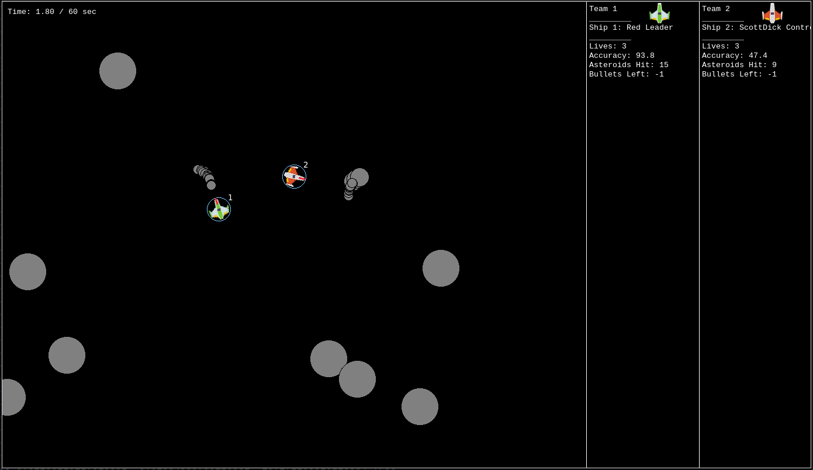

# Genetic Fuzzy Logic Asteroids Controller 

## Overview

This project implements an intelligent controller for an asteroids-style game, written in Python.
The controller is powered by a fuzzy inference system, which has been optimized using a genetic algorithm for smarter in-game decision making.


The goal of the controller is to dynamically pilot a spaceship, targeting and avoiding asteroids, while using fuzzified logic rules learned through evolutionary training. The genetic controller runs against a baseline scenario after training.



---

## Features

**Fuzzy Logic Controller** 
Handles ship actions (e.g., thrust, rotation, shooting) based on real-time game state inputs.

**Genetic Algorithm Optimization**
The fuzzy system's rule base and membership functions are evolved over multiple generations to improve performance.

---

## Installation

Install required dependencies:
```
pip install -r requirements.txt
```
To run the scenario vs a baseline ship, use the following cmd:
```
python genetic_scenario.py
```

---

## Technologies Used

    Python 3.10+

    scikit-fuzzy for fuzzy logic operations

    NumPy for numerical computations

    Kessler Game environment for simulation

    Custom Genetic Algorithm for evolving fuzzy parameters
